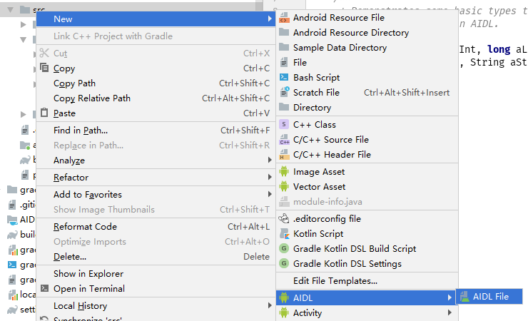

# AIDL跨进程通信

## 什么是AIDL

AIDL(Android Interface Definition Language)称为Android接口定义语言，如它名字所言，它是用来定义跨进程接口的，语法和Java类似，谷歌开发出这种语言的目的是希望简化开发者开发跨进程通信程序的难度，当我们新建了一个AIDL文件后，会在gen目录下自动生成对应的java代码。

跨进程通信在Android应用开发中使用的并不算的多，但它却是每个Android开发者必须要了解熟悉的东西，因为它涉及到Android特有的一种跨进程机制-Binder机制。如果熟悉Android Framework源码的小伙伴一定会发现，Binder在Android源码中几乎随处可见，即使是简单的Activity跳转最后也用到了Binder机制。

## Example

今天来模拟一个场景，如果你的应用中使用了很多h5页面，那我们可以选择把WebView这个Activity拆出为一个单独的进程，这样做的好处就是两个进程相互独立，WebView的Activity发生内存泄漏甚至崩溃，都不会对主进程造成影响。但是这样做也有一个缺点，就是数据同步问题，因为多进程中单例是失效的，文件共享也要控制好读写冲突。这种情况下使用AIDL跨进程其实是一个很好的解决方案，WebView进程不关心数据是存放在内存还是文件的，需要数据的时候就向主进程请求就可以了，这样保持了数据源的单一性，也不用考虑读写冲突的问题。

下面我们就一步一步的完成这个例子

1. 在src目录下新建一个aidl文件夹用于放置aidl文件，默认是在src目录下，当然也可以通过更改gradle文件更改这个目录。如果是使用Android Studio的话也可以右键->new->AIDL->AIDL file的方式来新建aidl文件。


    新建的文件名字为IUserManager, Android Studio会自动为我们生成一个方法，主要是给我们介绍如何使用的。

    ```java
    // IUserManager.aidl
    package com.hao.aidltest;

    // Declare any non-default types here with import statements

    interface IUserManager {
        /**
        * Demonstrates some basic types that you can use as parameters
        * and return values in AIDL.
        */
        void basicTypes(int anInt, long aLong, boolean aBoolean, float aFloat,
                double aDouble, String aString);
    }
    ```

    在继续开始前，我们先介绍下AIDL支持的数据类型吧

   - Java中原有的基本类型如int, long, char, boolean等
   - String类型
   - CharSequence类型
   - Parcelable类型
   - List类型，List中的所有元素都必须是以上支持的类型
   - Map类型，Map中的所有的元素都必须是以上支持的类型

2. 新建一个用户信息类UserInfo,并实现Parcelable接口，从上面AIDL支持的类型我们知道，如果想要想通过AIDL跨进程传递对象数据，则必须要该对象实现Parcelable接口

   ```java
   public class UserInfo implements Parcelable {
        private long id;
        private String username;
        private String password;

        public UserInfo(long id, String username, String password) {
            this.id = id;
            this.username = username;
            this.password = password;
        }

        protected UserInfo(Parcel in) {
            id = in.readLong();
            username = in.readString();
            password = in.readString();
        }

        public static final Creator<UserInfo> CREATOR = new Creator<UserInfo>() {
            @Override
            public UserInfo createFromParcel(Parcel in) {
                return new UserInfo(in);
            }

            @Override
            public UserInfo[] newArray(int size) {
                return new UserInfo[size];
            }
        };

        @NonNull
        @Override
        public String toString() {
            return "userId=" + id + "\n"
                   + "username=" + username + "\n"
                   + "password=" + password;
        }

        @Override
        public int describeContents() {
            return 0;
        }

        @Override
        public void writeToParcel(Parcel dest, int flags) {
            dest.writeLong(id);
            dest.writeString(username);
            dest.writeString(password);
        }
    }
   ```

3. 仅仅是实现Parcelable还是不够的，还需要新建一个同名文件UserInfo.aidl

   ```java
    package com.hao.aidltest;
    // 只有在这里声明了UserInfo，在IUserManager中才可以使用
    parcelable UserInfo;
   ```

4. 完成IUserManager中接口的定义

   ```java
    package com.hao.aidltest;

    import com.hao.aidltest.UserInfo;

    interface IUserManager {
        // 获取用户信息
        UserInfo getUserInfo();
        // 更新用户信息
        void updateUserInfo(in UserInfo info);
    }
   ```

   这里有一点需要注意，尽管UserInfo和IUserManager是在同一个package下的，但仍然需要手动导入UserInfo。这一点和Java有些区别。

   目前为之，所需的AIDL接口已经创建完了，rebuild一下，我们看下它生成的文件，打开build/generated/aidl_source_output_dir/debug/compileDebugAidl/out目录，我们就看到了生成的IUserManager.java文件,生成的内容很多我就不放上来了，里面是一个IUserManager的接口和两个实现IUserManager接口的类，类Proxy和一个抽象类Stub，我们要接下来做的就是实现抽象类里的方法。

5. 新建一个Service，并创建一个IUserManager.Stub对象然后在UserInfoService的onBind方法中返回

   ```java
   public class UserInfoService extends Service {
        private Binder binder = new IUserManager.Stub() {
            @Override
            public UserInfo getUserInfo() throws RemoteException {
                return UserManager.INSTANCE.getUserInfo();
            }

            @Override
            public void updateUserInfo(UserInfo info) throws RemoteException {
                UserManager.INSTANCE.updateUserInfo(info);
            }
        };

        @Nullable
        @Override
        public IBinder onBind(Intent intent) {
            return binder;
        }
    }
   ```

   上面那两个方法就是我们在AIDL中定义的接口，这里才是真正的实现接口的地方。为了实现那两个方法，我们用一个单例类来管理应用中的用户信息

   ```java
    public enum  UserManager {
        INSTANCE;

        private UserInfo userInfo;

        public UserInfo getUserInfo() {
            return userInfo;
        }

        public void updateUserInfo(UserInfo userInfo) {
            this.userInfo = userInfo;
        }
    }
   ```

6. 接下来就是如何使用了，首先我们需要一个运行在子进程的WebViewActivity去获取服务

   ```java
    public class WebViewActivity extends Activity {
        private IUserManager userManager;

        @Override
        protected void onCreate(@Nullable Bundle savedInstanceState) {
            super.onCreate(savedInstanceState);
            setContentView(R.layout.activity_webview);
            bindService(new Intent(this, UserService.class), new ServiceConnection() {
                @Override
                public void onServiceConnected(ComponentName name, IBinder service) {
                    userManager = IUserManager.Stub.asInterface(service);
                }

                @Override
                public void onServiceDisconnected(ComponentName name) {
                    userManager = null;
                }
            }, Context.BIND_AUTO_CREATE);
        }
    }
   ```

   在onServiceConnected方法中通过IUserManager.Stub.asInterface就可以获取到IUserManager的实例，然后就可以使用IUserManager中的方法了。

## in, out, inout

在前面定义IUserManager接口的updateUserInfo方法的时候，我们使用了定向tag，AIDL提供了三个定向tag供开发这使用：in,out,inout。在官网上关于Android定向tag的定义是这样的
> All non-primitive parameters require a directional tag indicating which way the data goes. Either in, out, or inout.Primitives are in by default, and cannot be otherwise.
> Caution: You should limit the direction to what is truly needed, because marshalling parameters is expensive.

翻译过来就是说所有的非基本类型都需要用一个定向tag来表示数据走向的。基本数据类型默认就是in并且不能修改为其他类型。官方还给出警告，因为编组参数开销非常大，所以要限定数据走向为真正需要的方向。

下面我们就说一下这三个tag的区别

- in：表示数据从客户端流向服务端，服务端会收到客户端对象的完整数据，并且服务端对对象的修改不会影响到客户端数据。比如IUserManager中的updateUserInfo方法我们使用了in，我们在子进程调用updateUserInfo会传给主进程一个UserInfo对象，主进程获取到的UserInfo与子进程的完全一致，这时候如果主进程对UserInfo做出修改也不会对子进程的UserInfo有影响。这就类似于深拷贝。
- out：表示数据从服务端流向客户端，这种情况下服务端会收到客户端对象，但是该对象里面的字段都为空，如果我们这服务端对该对象做出修改，客户端的对象会同步修改。比如IUserManager中的updateUserInfo方法我们使用了out，我们在子进程调用updateUserInfo传给主进程一个UserInfo对象，这时候主进程会收到一个各个字段都是空的UserInfo对象，但是如果我们在主进程对UserInfo做出修改，子进程中的UserInfo也会同步修改。
- inout：理解了in和out后，这个就很容易理解了。inout就是in和out的联合体，表示数据在客户端和服务端双向流动，服务端既可以收到客户端的完整对象，同时服务端对该对象的修改也会同步到客户端。

关于in,out,inout更多的内容可以参考[AIDL中的in、out、inout的区别](https://www.jianshu.com/p/a61da801b919)

## 注意事项

1. 子进程通过bindService获取服务的过程是耗时的，也就是说如果Activity的onCreate或者第一次onResume使用时，IUserManager很可能还未初始化完成，所以在使用前记得判空，或者把逻辑移动到onServiceConnected方法中
2. 如果WebViewActivity在调用IUserManager的updateUserInfo方法是在子线程调用的，那么主进程的Service中updateUserInfo也会是在子进程调用
3. 通过IUserManager调用的方式都是同步的，所以如果服务执行的时间很长，很可能会造成ANR

## 总结

最后我们总结一下使用AIDL跨进程通信的步骤

1. 新建AIDL接口文件定义我们需要的接口
2. 如果接口用到了对象数据，需要该对象实现Parcelable接口，并且需要在同名的AIDL文件中声明
3. 新建一个Service，并实现Stub抽象类中的方法
4. 在子进程绑定服务，并在onServiceConnected获取到服务接口，之后就可以调用接口的方法了
