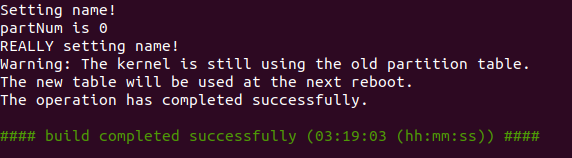
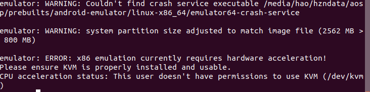
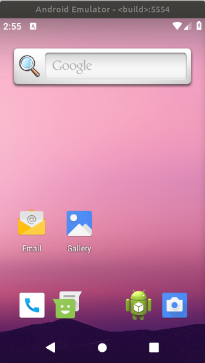

# AOSP源码编译（Android 9.0）

操作系统：ubuntu 18

1. 安装git并配置邮箱密码

   ```shell
   sudo apt install git
   git config --global user.name "John Doe"
   git config --global user.email johndoe@example.com
   ```

2. 安装Repo

   ```shell
    mkdir ~/bin
    PATH=~/bin:$PATH
    curl https://storage.googleapis.com/git-repo-downloads/repo > ~/bin/repo
    chmod a+x ~/bin/repo
   ```

   上面脚本的作用是创建bin目录，下载repo文件到bin目录，修改repo的权限为可执行，把bin添加到环境变量中。最后一步添加环境变量的方式只在当前命令行窗口有效。如果想要对所有命令行窗口都有效，需要修改.bashrc配置文件

3. 下载源码。官方下载源码的步骤需要链接外网，国内下载巨慢而且非常不稳定，所以强烈推荐使用国内镜像，[清华大学开源软件镜像站](https://mirrors.tuna.tsinghua.edu.cn/help/AOSP/)或者[中科大开源软件镜像](https://lug.ustc.edu.cn/wiki/mirrors/help/aosp)，这里我选择了清华大学开源软件镜像站，由于Android源码现在非常巨大，所以推荐先下载初始化包，这个包大约46G左右
4. 建立工作目录，记得选择容量大的硬盘

   ```shell
    mkdir WORKING_DIRECTORY
    cd WORKING_DIRECTORY
   ```

   把之前下载的初始化包拷到工作目录并解压

   ```shell
   tar -xvf aosp-latest.tar
   ```

5. 初始化仓库并同步源码

   ```shell
   repo init -u https://aosp.tuna.tsinghua.edu.cn/platform/manifest
   ```

    如果需要某个特定版本的Android源码，可用-b参数指定分支，这里我指定为android-9.0.0_r1

    ```shell
    repo init -u https://aosp.tuna.tsinghua.edu.cn/platform/manifest -b android-9.0.0_r1
    ```

    同步源码树

    ```shell
    repo sync
    ```

6. 源码准备好后，就该准备编译环境了，先安装下面的包，如果编译过程中还是报错，就按照报错提示安装相应依赖

   ```shell
   sudo apt update
   sudo apt install openjdk-8-jdk git-core gnupg flex bison gperf build-essential zip curl zlib1g-dev gcc-multilib g++-multilib libc6-dev-i386 lib32ncurses5-dev x11proto-core-dev libx11-dev lib32z-dev ccache libgl1-mesa-dev libxml2-utils xsltproc unzip
   ```

7. 在AOSP根目录，执行以下目录

   ```shell
    source build/envsetup.sh
    make clobber
    lunch aosp_x86-eng  // 指定编译目标的格式
   ```

   编译时间很长，可能需要几个小时，编译成功后会看到下图

   

8. 启动模拟器

   ```shell
    source build/envsetup.sh
    lunch 5
    emulator
   ```

   在ubuntu18的版本通常会出现如下错误

   

    解决办法

    ```shell
    sudo apt install qemu-kvm
    sudo adduser <username> kvm
    sudo chown <username> /dev/kvm
    ```

    在运行模拟器，就可以运行了

    

## 导入AS

1. 编译idegen

   ```shell
   source build/ensetup.sh
   make idegen
   ```

2. 执行idegen.sh

    ```shell
    sudo development/tools/idegen/idegen.sh
    ```
