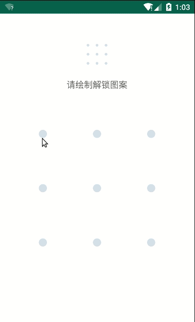
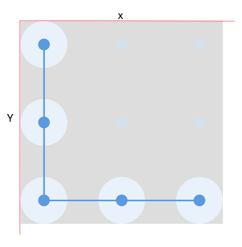
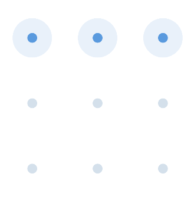

# Android 自定义手势密码View

银行和支付宝等金融app在打开的时候都会验证手势密码，这也属于隐私安全的一部分，今天我们就从头开始一步一步的自定义一个手势密码View，废话不多说，先看下效果吧



俗话说授人以鱼不如授人以渔，这个View并不算一个通用的手势密码View，而是模仿某理财产品实现的。但是原理是相同的，读者可以根据自己的业务需求定制自己的手势密码控件。

## 思路

自定义View其实很简单，总共就是测量，绘制和触摸反馈这三个步骤。但是涉及到具体的控件时，我们可以划分的更加细致，在开始写代码之前最好先根据观察样例列出一系列子问题，然后逐步去解决各个子问题。

1. 限制View的宽高为相同数值，即实现SquareView
2. 计算9个中心点的坐标
3. 绘制正常状态下的9个中心点
4. 绘制被选择状态下圆
5. 处理触摸事件
6. path的绘制
7. 回调处理与error
8. 属性定制

### SquareView

```java
    @Override
public class GestureLockView extends View {

    public GestureLockView(Context context) {
        this(context, null);
    }

    public GestureLockView(Context context, @Nullable AttributeSet attrs) {
        this(context, attrs, 0);
    }

    public GestureLockView(Context context, @Nullable AttributeSet attrs, int defStyleAttr) {
        super(context, attrs, defStyleAttr);
    }

    @Override
    protected void onMeasure(int widthMeasureSpec, int heightMeasureSpec) {
        super.onMeasure(widthMeasureSpec, heightMeasureSpec);
        //  获取View的宽和高
        final int widthSize = getMeasuredWidth();
        final int heightSize = getMeasuredHeight();
        //  取宽高中的最小值
        final int size = Math.min(widthSize, heightSize);
        // 重新设置宽和高
        setMeasuredDimension(size, size);
    }
}
```

这个的实现就是重写onMeasure方法，在执行过super.onMeasure(widthMeasureSpec, heightMeasureSpec)后，View的宽和高已经定了，我们要做的就是比较View的宽高并重新赋值

### 计算9个中心点的坐标

从第一步中我们已经限制了宽高为相同的尺寸，那圆心的位置由什么决定呢？



上图展示了View的坐标系，横轴为x，右为正，纵轴为y，下为正。
我们以图上5个点为例，同时设正方形的边长为size，圆的半径为radius。很容易计算得知第一个点的坐标为(radius, radius)，第二个点的坐标是(radius, size / 2)，第三个点的坐标为(radius, size - radius)，第四个点的坐标是(size / 2, size - radius)，第五个点的坐标为(size - radius, size -radius)。

这9个点的坐标在绘制我们成我们会经常使用，所以最好就是把它们保存下来。为此我们可以新建一个Cell类

```java
    private class Cell {
        // x坐标
        float x;
        // y 坐标
        float y;
        //  当前点的位置
        int pos;
        // 是否被选中
        boolean selected;

        Cell(int x, int y) {
            this.x = x;
            this.y = y;
            selected = false;
        }
    }
```

Cell就是代表每个圆的类，内部保存了圆心坐标，还有一个selected用来表示当前Cell是否被选中，因为这些圆只能被单次选中，所以需要标记一下。还有pos表示当前点的位置，当我们绘制了手势密码后，要把这些被选中的Cell按顺序回调给用户，但是我们不能回调坐标，所以增加一个位置信息用来标记当前Cell。pos和selected都是后面要使用的，为了避免重复代码就一次性都写了出来。

由于Cell的圆心信息依赖于View的宽高，所以View的宽高是在onMeasure中计算出来的，所以Cell的赋值也要放在onMeasure中

```java
    @Override
    protected void onMeasure(int widthMeasureSpec, int heightMeasureSpec) {
        super.onMeasure(widthMeasureSpec, heightMeasureSpec);
        final int widthSize = getMeasuredWidth();
        final int heightSize = getMeasuredHeight();
        final int size = Math.min(widthSize, heightSize);
        setMeasuredDimension(size, size);
        // 为防止圆重叠，所以要限制radius的大小
        radius = Math.min(size / 6f, radius);

        float[] n = {radius, size / 2f, size - radius};
        for (int i = 0; i < 3; i++) {
            for (int j = 0; j < 3; j++) {
                cells[i][j].x = n[j];
                cells[i][j].y = n[i];
            }
        }
    }
```

### 绘制正常状态下的9个中心点

上一步我们已经计算出了圆心坐标，接下来就是要根据圆心坐标绘制圆心。绘制嘛，首先要有画笔

```java
    private void init() {
        cells = new Cell[3][3];
        for (int i = 0; i < 3; i++) {
            for (int j = 0; j < 3; j++) {
                cells[i][j] = new Cell(0, 0);
                cells[i][j].pos = 3 * i + j + 1;
            }
        }
        paint = new Paint(Paint.ANTI_ALIAS_FLAG);
        paint.setStyle(Paint.Style.STROKE);
        paint.setStrokeCap(Paint.Cap.ROUND);
        paint.setStrokeWidth(Util.dp2px(getContext(), 10));
        paint.setColor(ContextCompat.getColor(getContext(), R.color.pointColor));
    }
```

然后重写draw方法

```java
    @Override
    public void draw(Canvas canvas) {
        super.draw(canvas);
        for (int i = 0; i < 3; i++) {
            for (int j = 0; j < 3; j++) {
                canvas.drawPoint(cells[i][j].x, cells[i][j].y, paint);
            }
        }
    }
```

这样9个圆心点就绘制完成了

### 绘制被选择状态下圆

当用户点击并滑动的过程中，被选中的圆需要绘制出来，我们可以暂不考虑用户的点击滑动事件，只考虑过程，当圆被选中，我们需要把它们单独保存起来。

```java
    private LinkedList<Cell> selectCells;
    private void init() {
        selectCells = new LinkedList<>();
    }
```

在onMeasure计算出9个点的坐标后，我们可以把第一行三个点加入到selectedCells中用来模拟被选中状态

```java
    @Override
    protected void onMeasure(int widthMeasureSpec, int heightMeasureSpec) {
        super.onMeasure(widthMeasureSpec, heightMeasureSpec);
        final int widthSize = getMeasuredWidth();
        final int heightSize = getMeasuredHeight();
        final int size = Math.min(widthSize, heightSize);
        setMeasuredDimension(size, size);
        radius = Math.min(size / 6f, radius);

        float[] n = {radius, size / 2f, size - radius};
        for (int i = 0; i < 3; i++) {
            for (int j = 0; j < 3; j++) {
                cells[i][j].x = n[j];
                cells[i][j].y = n[i];
            }
        }
        selectCells.add(cells[0][0]);
        selectCells.add(cells[0][1]);
        selectCells.add(cells[0][2]);
    }
```

接下来在draw中绘制

```java
    private void setPointPaint(boolean selected) {
        paint.setStyle(Paint.Style.STROKE);
        paint.setStrokeCap(Paint.Cap.ROUND);
        paint.setStrokeWidth(pointSize);
        paint.setColor(selected ? selectPointColor : pointColor);
    }
    private void setCirclePaint() {
        paint.setStyle(Paint.Style.FILL);
        paint.setColor(error ? errorCircleColor : circleColor);
    }
    @Override
    public void draw(Canvas canvas) {
        super.draw(canvas);
        // 绘制正常状态的圆心
        setPointPaint(false);
        for (int i = 0; i < 3; i++) {
            for (int j = 0; j < 3; j++) {
                canvas.drawPoint(cells[i][j].x, cells[i][j].y, paint);
            }
        }

        for (Cell cell : selectCells) {
            //  被选中的圆
            setCirclePaint();
            canvas.drawCircle(cell.x, cell.y, radius, paint);
            // 被选中的圆心
            setPointPaint(true);
            canvas.drawPoint(cell.x, cell.y, paint);
        }
    }
```

看下效果



### 处理触摸事件

View的触摸事件主要就是重写onTouchEvent方法，按需处理其中的ACTION_DOWN，ACTION_MOVE，ACTION_UP，ACTION_CANCEL方法。

```java
    @Override
    public boolean onTouchEvent(MotionEvent event) {
        switch (event.getAction()) {
            case MotionEvent.ACTION_DOWN:
                handleActionDown(event);
                return true;
            case MotionEvent.ACTION_MOVE:
                handleActionMove(event);
                return true;
            case MotionEvent.ACTION_UP:
                handleActionUp(event);
                return true;
            case MotionEvent.ACTION_CANCEL:
                clear();
                return true;
        }
        return super.onTouchEvent(event);
    }
```

#### ACTION_DOWN

```java
    private void handleActionDown(MotionEvent event) {
        clear();
        currentX = event.getX();
        currentY = event.getY();
        checkAndAdd(currentX, currentY);
    }
    public void clear() {
         done = false;
        //  清空已选择列表
        selectCells.clear();
        // 重置cell数组
        for (int i = 0; i < 3; i++) {
            for (int j = 0; j < 3; j++) {
                cells[i][j].selected = false;
            }
        }
        invalidate();
    }
    private void checkAndAdd(float x, float y) {
        Cell cell = null;
        boolean find = false;
        for (int i = 0; i < 3; i++) {
            for (int j = 0; j < 3; j++) {
                if (Math.pow(x - cells[i][j].x, 2) + Math.pow(y - cells[i][j].y, 2) < radius * radius) {
                    cell = cells[i][j];
                    find = true;
                    break;
                }
            }
            if (find) {
                break;
            }
        }
        if (find && !cell.selected) {
            cell.selected = true;
            selectCells.add(cell);
        }
    }
```

handleActionDown方法中做了三件事

1. 重置View的状态
2. 记录当前位置的坐标
3. 判断当前位置是否在Cell范围内

前两个步骤很好理解，最重要的就是第三步，在坐标系中计算两点之间的距离可以通过  (x1^2 - x2^2) + (y1^2 - y2^2) = radius^2。遍历cell，如果当前坐标到圆心的距离小于radius则表示cell被选中，如果cell是第一次被选中就加入到selectedCell列表中

#### ACTION_MOVE

```java
    private void handleActionMove(MotionEvent event) {
        currentX = event.getX();
        currentY = event.getY();
        checkAndAdd(currentX, currentY);
        invalidate();
    }
```

Move事件处理和Down事件基本是一致的，记录当前坐标，然后判断当前坐标是否在cell范围内，把选中的cell添加到selectedCell中。记得在最后添加invalidate方法触发View的重绘。

#### ACTION_UP

```java
    private void handleActionUp(MotionEvent event) {
        done = true;
        invalidate();
    }
```

这个事件就是标记下触摸事件已经完成

### path的绘制

到目前为止，我们已经可以通过触摸选中Cell，但是还少了一步，就是被选中的圆之间要通过直线连接。这个可以用Path实现，在圆心与圆心之间用Path的lineTo即可实现

```java
    private Path path;

    private void init() {
        path = new Path();
    }

    private void checkAndAdd(float x, float y) {
        Cell cell = null;
        boolean find = false;
        for (int i = 0; i < 3; i++) {
            for (int j = 0; j < 3; j++) {
                if (Math.pow(x - cells[i][j].x, 2) + Math.pow(y - cells[i][j].y, 2) < radius * radius) {
                    cell = cells[i][j];
                    find = true;
                    break;
                }
            }
            if (find) {
                break;
            }
        }
        if (find && !cell.selected) {
            cell.selected = true;
            //  第一个点需要move
            if (selectCells.size() <= 0) {
                path.moveTo(cell.x, cell.y);
            } else {
                path.lineTo(cell.x, cell.y);
            }
            selectCells.add(cell);
            if (listener != null) {
                listener.onCellAdd(getGes());
            }
        }
    }

    private void setPathPaint() {
        paint.setStyle(Paint.Style.STROKE);
        paint.setStrokeWidth(Util.dp2px(getContext(), 2));
        paint.setColor(R.color.pathColor);
    }

    @Override
    public void draw(Canvas canvas) {
        super.draw(canvas);
        if (selectCells.size() > 1) {
            setPathPaint();
            canvas.drawPath(path, paint);
        }
    }
```

核心代码就在于checkAndAdd中，当检测到新的cell时，判断是否是第一个cell，如果是就是调用Path的moveTo方法，否则就调用lineTo添加直线，最后在draw方法中绘制出来即可。  

上面绘制的是圆与圆之间的之间，还有条直线是在Move事件中，最后一个圆心到当前位置还有条直线，由于在之前的触摸事件处理中我们保存了当前位置在currentX和currentY中，所以这个可以直接在draw方法中绘制

```java
    @Override
    public void draw(Canvas canvas) {
        super.draw(canvas);
        if (selectCells.size() > 0 && !done) {
            setPathPaint();
            canvas.drawLine(selectCells.get(selectCells.size() - 1).x, selectCells.get(selectCells.size() - 1).y, currentX, currentY, paint);
        }
    }
```

### 回调处理与error

关于这个自定义View的绘制过程已经全部完成了，接下来要做的就是回调处理了，这个相对比较灵活，主要取决与你需要什么事件

```java
    public interface GestureLockListener {
        // 触摸事件开始
        void onStart();
        // 当前cell被选中触发
        void onCellAdd(int[] ges);
        //  ACTION_UP事件触发，返回值为boolean， true表示成功触发onSuccess方法， false表示绘制的手势密码不符合要求触发onError方法
        boolean onFinish(int[] ges);

        void onSuccess(int[] ges);

        void onError(int[] ges);
    }

    private void handleActionDown(MotionEvent event) {
        if (listener != null) {
            listener.onStart();
        }
    }


    private void checkAndAdd(float x, float y) {
        if (find && !cell.selected) {;
            if (listener != null) {
                listener.onCellAdd(getGes());
            }
        }
    }

    private void handleActionUp(MotionEvent event) {
        done = true;
        if (listener != null && selectCells.size() > 0) {
            int[] pas = getGes();
            boolean success = listener.onFinish(pas);
            if (success) {
                listener.onSuccess(pas);
            } else {
                error = true;
                listener.onError(pas);
            }
        }
        invalidate();
    }

    private int[] getGes() {
        if (selectCells != null && selectCells.size() > 0) {
            int[] result = new int[selectCells.size()];
            for (int i = 0; i < result.length; i++) {
                result[i] = selectCells.get(i).pos;
            }
            return result;
        }
        return null;
    }
```

在回调事件中可能会有error发生，比如在确认手势密码的时候两次输入不一致。当error方法时，圆和圆与圆之间的连线会变成红色，这个很容易处理，只需要在setPaint的时候改一下颜色就可以了

```java
    private void setPointPaint(boolean selected) {
        paint.setStyle(Paint.Style.STROKE);
        paint.setStrokeCap(Paint.Cap.ROUND);
        paint.setStrokeWidth(pointSize);
        paint.setColor(selected ? (error ? R.color.errorPointColor : R.color.selectPointColor) : R.color.pointColor);
    }

    private void setPathPaint() {
        paint.setStyle(Paint.Style.STROKE);
        paint.setStrokeWidth(Util.dp2px(getContext(), 2));
        paint.setColor(error ? R.color.errorPathColor : R.color.pathColor);
    }

    private void setCirclePaint() {
        paint.setStyle(Paint.Style.FILL);
        paint.setColor(error ? R.color.errorCircleColor : R.color.circleColor);
    }
```

### 属性定制

这个和回调事件一样，取决于具体的需求，当前我们还是要尽可能的把易变属性都放在xml中配置比较好

```xml
    <declare-styleable name="GestureLockView">
        <attr name="radius" format="dimension"/>
        <attr name="pointSize" format="dimension"/>
        <attr name="pointColor" format="color"/>
        <attr name="selectPointColor" format="color"/>
        <attr name="errorPointColor" format="color"/>
        <attr name="circleColor" format="color"/>
        <attr name="pathColor" format="color"/>
        <attr name="errorPathColor" format="color"/>
        <attr name="errorCircleColor" format="color"/>
    </declare-styleable>
```

```java
       TypedArray a = context.obtainStyledAttributes(attrs, R.styleable.GestureLockView);
        pointColor = a.getColor(R.styleable.GestureLockView_pointColor, ContextCompat.getColor(context, R.color.pointColor));
        selectPointColor = a.getColor(R.styleable.GestureLockView_selectPointColor, ContextCompat.getColor(context, R.color.selectPointColor));
        errorPointColor = a.getColor(R.styleable.GestureLockView_errorPointColor, ContextCompat.getColor(context, R.color.errorPointColor));
        pathColor = a.getColor(R.styleable.GestureLockView_pathColor, ContextCompat.getColor(context, R.color.pathColor));
        errorPathColor = a.getColor(R.styleable.GestureLockView_errorPathColor, ContextCompat.getColor(context, R.color.errorPathColor));
        circleColor = a.getColor(R.styleable.GestureLockView_circleColor, ContextCompat.getColor(context, R.color.circleColor));
        errorCircleColor = a.getColor(R.styleable.GestureLockView_errorCircleColor, ContextCompat.getColor(context, R.color.errorCircleColor));
        radius = a.getDimension(R.styleable.GestureLockView_radius, Util.dp2px(context, 30));
        pointSize = a.getDimension(R.styleable.GestureLockView_pointSize, Util.dp2px(context, 10));
        a.recycle();
```

上面是我定义的一些属性，比较多，几乎给每种状态的颜色都添加的属性，这样做有一个好处，就是例子里那个小的手势密码指示器，我完全用同一个View就可以模拟出来，只要把圆的颜色设置成透明，再把圆心的尺寸调小一些就可以了。

最后附上[demo地址](https://github.com/haozhn/LearnSelf/tree/master/app/src/main/java/com/example/hao/learnself/date_2019_7_26)，
