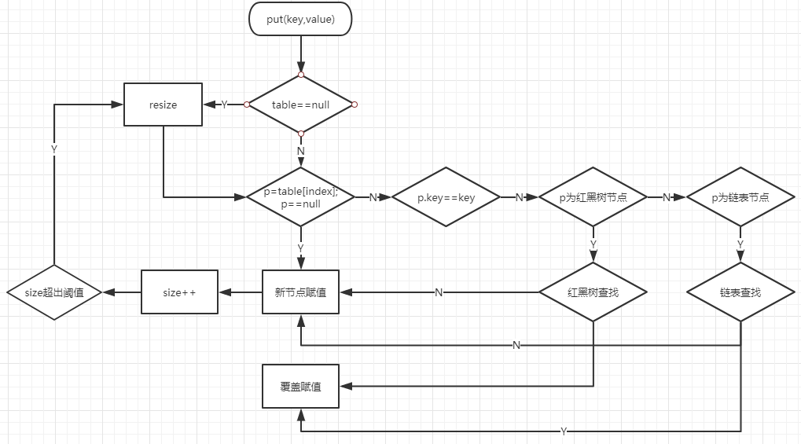
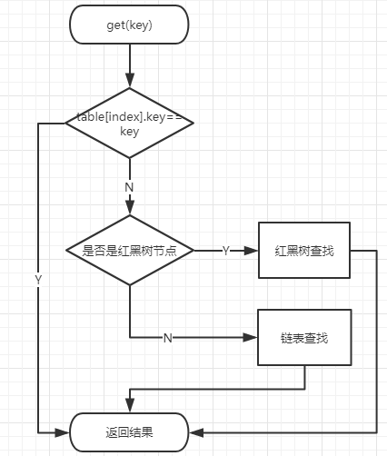

# HashMap源码解析

## HashMap中的静态变量

- DEFAULT_INITIAL_CAPACITY：默认容量大小，值为16
- MAXIMUM_CAPACITY：
- DEFAULT_LOAD_FACTOR：
- TREEIFY_THRESHOLD：
- UNTREEIFY_THRESHOLD
- MIN_TREEIFY_CAPACITY

## HashMap的创建

HashMap有四种构造方法，我们分别来看下

```java
    public HashMap() {
        this.loadFactor = DEFAULT_LOAD_FACTOR; // all other fields defaulted
    }
```

第一种，也是默认构造方法，只是把负载因子参数设置为默认值

```java
    public HashMap(int initialCapacity) {
        this(initialCapacity, DEFAULT_LOAD_FACTOR);
    }

    public HashMap(int initialCapacity, float loadFactor) {
        if (initialCapacity < 0)
            throw new IllegalArgumentException("Illegal initial capacity: " +
                                               initialCapacity);
        if (initialCapacity > MAXIMUM_CAPACITY)
            initialCapacity = MAXIMUM_CAPACITY;
        if (loadFactor <= 0 || Float.isNaN(loadFactor))
            throw new IllegalArgumentException("Illegal load factor: " +
                                               loadFactor);
        this.loadFactor = loadFactor;
        this.threshold = tableSizeFor(initialCapacity);
    }
```

第二种传入初始容量的构造方法最后也调用了第三种构造方法，所以我们直接看第三种构造方法，这个方法先是对初始容量initialCapacity和负载因子loadFactor做了合法性校验，然后就是赋值了，这里有个很有趣的方法tableSizeFor，它可以接收一个参数，并返回大于这个参数的最小的2的幂，它的实现如下

```java
    static final int tableSizeFor(int cap) {
        int n = cap - 1;
        n |= n >>> 1;
        n |= n >>> 2;
        n |= n >>> 4;
        n |= n >>> 8;
        n |= n >>> 16;
        return (n < 0) ? 1 : (n >= MAXIMUM_CAPACITY) ? MAXIMUM_CAPACITY : n + 1;
    }
```

当时我刚看到这个方法的时候也是一脸懵逼的，如果不是有注释，我都不知道这个方法是要做什么的，不过用几个数实际验算后就发现了其中的奥秘了。首先我们要观察下2的幂都有什么规律。

```java
2               // 00000000000000000000000000000010
4               // 00000000000000000000000000000100
8               // 00000000000000000000000000001000
16              // 00000000000000000000000000010000
32              // 00000000000000000000000000100000
64              // 00000000000000000000000001000000
128             // 00000000000000000000000010000000
256             // 00000000000000000000000100000000
1073741824      // 01000000000000000000000000000000
1073741823      // 00111111111111111111111111111111
```

很容易发现它们的二进制只有一位是1，其余都是0。以64（1000000）为例，当传入参数为33（100001）到64（1000000）的时候，tableSizeFor方法都应该返回64，而tableSizeFor方法的第一步就是cap-1。我们看一下63（111111）和32（100000）有什么相同点呢？就是它们的最高位都是1。接下来我们看一下后面的五步位移的作用。

- >>>： 表示无符号右移，最高位补0
- |：按位或
  
为了更好的表示，我们以最大值1073741824一步一步的看下过程

```java
n = 1073741824      // 01000000000000000000000000000000
n >>> 1             // 00100000000000000000000000000000
n |= n >>> 1        // 01100000000000000000000000000000
n >>> 2             // 00011000000000000000000000000000
n |= n >>> 2        // 01111000000000000000000000000000
n >>> 4             // 00000111100000000000000000000000
n |= n >>> 4        // 01111111100000000000000000000000
n >>> 8             // 00000000011111111000000000000000
n |= n >>> 8        // 01111111111111111000000000000000
n >>> 16            // 00000000000000000111111111111111
n |= n >>> 16       // 01111111111111111111111111111111
```

懂了吗？只要最高位是1，这些位移操作就可以把最高位之后的全部填充为1。这时候再加1就可以得到2的幂了。

```java
    public HashMap(Map<? extends K, ? extends V> m) {
        this.loadFactor = DEFAULT_LOAD_FACTOR;
        putMapEntries(m, false);
    }
```

这是最后一种构造方法，以一个Map为构造参数，它先初始化了负载因子参数，然后putMapEntries把参数中的Map中的数据复制过来

```java
    final void putMapEntries(Map<? extends K, ? extends V> m, boolean evict) {
        int s = m.size();
        if (s > 0) {
            if (table == null) { // pre-size
                float ft = ((float)s / loadFactor) + 1.0F;
                int t = ((ft < (float)MAXIMUM_CAPACITY) ?
                         (int)ft : MAXIMUM_CAPACITY);
                if (t > threshold)
                    threshold = tableSizeFor(t);
            }
            else if (s > threshold)
                resize();
            for (Map.Entry<? extends K, ? extends V> e : m.entrySet()) {
                K key = e.getKey();
                V value = e.getValue();
                putVal(hash(key), key, value, false, evict);
            }
        }
    }
```

1. 先获取参数中Map的长度s
2. 如果长度s大于0且当前Map还没初始化，就通过s计算出阈值
3. 如果当前Map已经初始化了并且长度s大于当前阈值，就触发resize调整大小
4. 遍历参数Map逐一拷贝

## HashMap的put流程



上面是一张HashMap的put操作的流程图，下面我们就从源码分析一下

```java
    public V put(K key, V value) {
        return putVal(hash(key), key, value, false, true);
    }
```

这里对key值做了hash操作，我们看一下HashMap中的hash方法

```java
    /**
     * Computes key.hashCode() and spreads (XORs) higher bits of hash
     * to lower.  Because the table uses power-of-two masking, sets of
     * hashes that vary only in bits above the current mask will
     * always collide. (Among known examples are sets of Float keys
     * holding consecutive whole numbers in small tables.)  So we
     * apply a transform that spreads the impact of higher bits
     * downward. There is a tradeoff between speed, utility, and
     * quality of bit-spreading. Because many common sets of hashes
     * are already reasonably distributed (so don't benefit from
     * spreading), and because we use trees to handle large sets of
     * collisions in bins, we just XOR some shifted bits in the
     * cheapest possible way to reduce systematic lossage, as well as
     * to incorporate impact of the highest bits that would otherwise
     * never be used in index calculations because of table bounds.
     */
    static final int hash(Object key) {
        int h;
        return (key == null) ? 0 : (h = key.hashCode()) ^ (h >>> 16);
    }
```

这个函数的作用很简单，就是使key的hashcode高16位不变，低16位和高16位做了一次异或运算，然后设计者用了很长的一段注释来解释为什么这么做。要解释这个问题，就需要知道HashMap是如何计算数组下标的

```java
 (n - 1) & hash
```

在结合我们之前学的HashMap的容量是2的幂，那(n - 1) & hash实际生效的就是hash值的前log(n)位。但是一个好的hash算法为了使所有位都参与运算以保证随机性。所以作者综合考虑速度，作用，质量选择了把高16bit和低16bit异或了一下。下面我们看下putVal方法的实现

```java
    final V putVal(int hash, K key, V value, boolean onlyIfAbsent,
                   boolean evict) {
        Node<K,V>[] tab; Node<K,V> p; int n, i;
        // 如果tab为null就调用resize创建
        if ((tab = table) == null || (n = tab.length) == 0)
            n = (tab = resize()).length;
        // 计算index,如果index处值为null表示没有冲突，直接赋值
        if ((p = tab[i = (n - 1) & hash]) == null)
            tab[i] = newNode(hash, key, value, null);
        else {
            Node<K,V> e; K k;
            // index处有值，且index处的值的key与put的值的key完全相同
            if (p.hash == hash &&
                ((k = p.key) == key || (key != null && key.equals(k))))
                e = p;
            // index处为红黑树
            else if (p instanceof TreeNode)
                e = ((TreeNode<K,V>)p).putTreeVal(this, tab, hash, key, value);
            // index处为链表
            else {
                for (int binCount = 0; ; ++binCount) {
                    if ((e = p.next) == null) {
                        p.next = newNode(hash, key, value, null);
                        if (binCount >= TREEIFY_THRESHOLD - 1) // -1 for 1st
                            treeifyBin(tab, hash);
                        break;
                    }
                    if (e.hash == hash &&
                        ((k = e.key) == key || (key != null && key.equals(k))))
                        break;
                    p = e;
                }
            }
            // 如果e不为null，表示map中存在同样key的值，需要覆盖赋值
            if (e != null) { // existing mapping for key
                V oldValue = e.value;
                if (!onlyIfAbsent || oldValue == null)
                    e.value = value;
                afterNodeAccess(e);
                return oldValue;
            }
        }
        ++modCount;
        if (++size > threshold)
            resize();
        afterNodeInsertion(evict);
        return null;
    }

```

1. 首先判断table是否为null，如果为null触发resize
2. 计算当前key对应的index，如果当前index的节点为null,直接创建新节点赋值。
3. 当前index的节点不为null,比较index节点的key与put节点的key是否相同，如果相同就覆盖赋值
4. 能到这一步说明已经发生了碰撞，判断index节点是否是红黑树节点，如果是，在红黑树中查找put节点，如果能找到就是覆盖赋值，找不到新建节点赋值
5. 在链表中查找put节点，如果能找到就是覆盖赋值，找不到新建节点赋值。如果链表的大小超过TREEIFY_THRESHOLD-1，则将链表转换成红黑树
6. 如果是新建节点赋值，HashMap的size要加1，同时判断是否超过阈值，超过就进行resize

在上面的表述中，我们提到了红黑树，这是一个复杂的数据结构，而且红黑树也不是本篇的重点，我们只需知道红黑树和平衡二叉树类似，但是它的查找，插入，删除节点操作在最坏情况下也是对数级别的。

## HashMap的get流程



get流程相对put就简单很多了

```java
    public V get(Object key) {
        Node<K,V> e;
        return (e = getNode(hash(key), key)) == null ? null : e.value;
    }
```

先对key做hash运算，再调用getNode方法

```java
    final Node<K,V> getNode(int hash, Object key) {
        Node<K,V>[] tab; Node<K,V> first, e; int n; K k;
        if ((tab = table) != null && (n = tab.length) > 0 &&
            (first = tab[(n - 1) & hash]) != null) {
            if (first.hash == hash && // always check first node
                ((k = first.key) == key || (key != null && key.equals(k))))
                return first;
            if ((e = first.next) != null) {
                if (first instanceof TreeNode)
                    return ((TreeNode<K,V>)first).getTreeNode(hash, key);
                do {
                    if (e.hash == hash &&
                        ((k = e.key) == key || (key != null && key.equals(k))))
                        return e;
                } while ((e = e.next) != null);
            }
        }
        return null;
    }
```

1. 对table做合法性校验，不通过直接返回null
2. first为index处的第一个节点，先判断first与参数key是否相同，相同就直接返回first
3. 如果first是红黑树节点，就在红黑树中查找
4. 如果first是链表节点，就在链表查找
5. 都没找到返回null

## HashMap的resize流程

resize流程可以拆成两个子流程，第一个是对数组的扩容，第二个是把原数组的值映射到新数组。由于resize代码较长，我们分开来分析，先看下扩容的代码

```java
        Node<K,V>[] oldTab = table;
        int oldCap = (oldTab == null) ? 0 : oldTab.length;
        int oldThr = threshold;
        int newCap, newThr = 0;
        if (oldCap > 0) {
            if (oldCap >= MAXIMUM_CAPACITY) {
                threshold = Integer.MAX_VALUE;
                return oldTab;
            }
            else if ((newCap = oldCap << 1) < MAXIMUM_CAPACITY &&
                     oldCap >= DEFAULT_INITIAL_CAPACITY)
                newThr = oldThr << 1; // double threshold
        }
        else if (oldThr > 0) // initial capacity was placed in threshold
            newCap = oldThr;
        else {               // zero initial threshold signifies using defaults
            newCap = DEFAULT_INITIAL_CAPACITY;
            newThr = (int)(DEFAULT_LOAD_FACTOR * DEFAULT_INITIAL_CAPACITY);
        }
        if (newThr == 0) {
            float ft = (float)newCap * loadFactor;
            newThr = (newCap < MAXIMUM_CAPACITY && ft < (float)MAXIMUM_CAPACITY ?
                      (int)ft : Integer.MAX_VALUE);
        }
        threshold = newThr;
        @SuppressWarnings({"rawtypes","unchecked"})
            Node<K,V>[] newTab = (Node<K,V>[])new Node[newCap];
        table = newTab;
```
