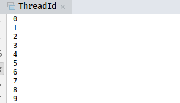

# ThreadLocal

在操作系统中我们学过进程和线程的区别，比较官方的话讲就是进程是操作系统分配资源的最小单位，而线程是操作系统调度的最小单位。线程附属于进程上，一个进程也最少要包含一个线程，进程与进程之间是相互独立的，但是一个进程的各个线程是共享进程资源的。


如果我们想要给每个线程维护私有数据，则有两种实现方式

1. 进程中维护一个变量表，每个线程都可以访问赋值
2. 每个线程单独维护一个变量表，线程只可以访问自己的私有变量表

第一种方式有个明显的弊端，就是多线程共享问题，多线程同时访问变量表时如何保证同步，如何尽量减少同步所带来的性能损耗都是需要考虑的问题。第二种方式由于是每个线程的私有变量表都是独立的，所以不存在同步问题。我们今天的主角ThreadLocal也正是通过第二种方式实现的

## 用法

- 创建ThreadLocal，ThreadLocal支持泛型，所以可以创建任何对象的ThreadLocal。创建ThreadLocal有两种方式，一种就是直接 **new** 一个ThreadLocal对象，另一个种则是调用静态方法withInitial

    ```java
    // 第一种方式
    ThreadLocal<String> local1 = new ThreadLocal<>();
    // 第二种方式
    ThreadLocal<String> local2 = ThreadLocal.withInitial(new Supplier<String>() {
            @Override
            public String get() {
                return "initial value2";
            }
    });
    ```

    从名字我们也可以才到，withInitial为ThreadLocal提供了一个初始值，当我们分别打印出local1和local2的值时，第一个是null，第二个则是初始值initial value2

    除了withInitial方法外，还有一个方法可以设置ThreadLocal的初始值，就是匿名内部类

    ```java
    ThreadLocal<String> local1 = new ThreadLocal<String>(){
            @Override
            protected String initialValue() {
                return "initial value1";
            }
        };
    ```

- 三个方法set，get，remove。ThreadLocal对外的方法只有这三个，从名字也容易知道这三个方法的含义

    ```java
    ThreadLocal<String> local = new ThreadLocal<>();
    System.out.println(local.get());  // null
    local.set("111");
    System.out.println(local.get());  // 111
    local.set("222");
    System.out.println(local.get());  // 222
    local.remove();
    System.out.println(local.get());  // null
    ```

ThreadLocal有哪些使用场景呢，在ThreadLocal源码注释里有一个简单的例子

```java
public class ThreadId {
    // Atomic integer containing the next thread ID to be assigned
    private static final AtomicInteger nextId = new AtomicInteger(0);

    // Thread local variable containing each thread's ID
    private static final ThreadLocal<Integer> threadId =
            new ThreadLocal<Integer>() {
                @Override
                protected Integer initialValue() {
                    return nextId.getAndIncrement();
                }
            };

    // Returns the current thread's unique ID, assigning it if necessary
    public static int get() {
        return threadId.get();
    }

    public static void main(String[] args) {
        for (int i = 0; i < 10; i++) {
            new Thread(new Runnable() {
                @Override
                public void run() {
                    System.out.println(ThreadId.get());
                }
            }).start();
        }
    }
}
```

按照正常我们的理解，threadId是静态变量，静态变量是属于类的，跟new出来的对象是无关的，但是运行结果如下



说明每个线程去调用ThreadId的get方法的时候获取到的值都是不同的。ThreadLocal在Android中也有非常重要的应用，Android的Handler机制中的Looper就是保存的ThreadLocal中。

## ThreadLocal原理

ThreadLocal对外的方法只有三个：set，get和remove。所以我们可以从这三个方法入手研究下其实现原理。

### ThreadLocal的set方法

```java
    public void set(T value) {
        Thread t = Thread.currentThread();
        ThreadLocalMap map = getMap(t);
        if (map != null)
            map.set(this, value);
        else
            createMap(t, value);
    }

    ThreadLocalMap getMap(Thread t) {
        return t.threadLocals;
    }

    void createMap(Thread t, T firstValue) {
        t.threadLocals = new ThreadLocalMap(this, firstValue);
    }
```

- 获取当前的运行的线程
- 获取当前线程的内部变量threadLocals
- 如果当前线程的threadLocals为空，就创建一个新的ThreadLocalMap对象
- 如果当前线程的threadLocals不为空，就调用threadLocals的set方法

在Thread类中有一个threadLocals变量，初始值为null，在第一次调用ThreadLocal的set或者get方法时，会创建一个ThreadLocalMap对象并赋值给threadLocals，ThreadLocalMap我们可以把它暂时当做HashMap，可以保存key-value，后面会细讲ThreadLocalMap的实现。

### ThreadLocal的get方法

```java
    public T get() {
        Thread t = Thread.currentThread();
        ThreadLocalMap map = getMap(t);
        if (map != null) {
            ThreadLocalMap.Entry e = map.getEntry(this);
            if (e != null) {
                @SuppressWarnings("unchecked")
                T result = (T)e.value;
                return result;
            }
        }
        return setInitialValue();
    }

    private T setInitialValue() {
        T value = initialValue();
        Thread t = Thread.currentThread();
        ThreadLocalMap map = getMap(t);
        if (map != null)
            map.set(this, value);
        else
            createMap(t, value);
        return value;
    }
```

- 获取当前的运行的线程
- 获取当前线程的内部变量threadLocals
- 如果threadLocals不为空，就调用map的getEntry方法，如果entry不为空，说明get方法命中，直接返回entry的value值
- 如果threadLocals为空，则会调用setInitialValue方法
- setInitialValue方法和set非常类似，setInitialValue基本和set(initialValue())的效果是一样的。

通过查看get的源码我们就可以知道为什么之前的例子里每个线程调用ThreadId的get方法会获取到不同的id。因为调用get的时候map为null，所以最后会走到initialValue方法。

### ThreadLocal的remove方法

```java
     public void remove() {
         ThreadLocalMap m = getMap(Thread.currentThread());
         if (m != null)
             m.remove(this);
     }
```

这个方法很简单，就是调用了ThreadLocalMap的remove方法而已。

## ThreadLocalMap实现原理

ThreadLocalMap是一种自定义的散列表，与我们常用的HashMap相似但是也有些不同，ThreadLocalMap并没有实现Map接口，而且它的key只能是ThreadLocal对象。如果熟悉HashMap的源码实现的话很容易理解ThreadLocalMap原理，我之前写过[HashMap源码解析](http://blog.leanote.com/post/haozhn/ffb21d78193d)，不熟悉的可以看一下。

### ThreadLocalMap内部实体类Entry

```java
        static class Entry extends WeakReference<ThreadLocal<?>> {
            /** The value associated with this ThreadLocal. */
            Object value;

            Entry(ThreadLocal<?> k, Object v) {
                super(k);
                value = v;
            }
        }
```

Entry类是WeakReference的子类，弱引用是Java四种引用之一，弱引用指向的内存只能存活到下次gc前。关于为什么要使用弱引用作为Map的key我们放到最后讲，Entry还包含一个Object类型的value，这个value就是我们实际保存的值。

### ThreadLocalMap的构造方法

```java
        ThreadLocalMap(ThreadLocal<?> firstKey, Object firstValue) {
            table = new Entry[INITIAL_CAPACITY];
            int i = firstKey.threadLocalHashCode & (INITIAL_CAPACITY - 1);
            table[i] = new Entry(firstKey, firstValue);
            size = 1;
            setThreshold(INITIAL_CAPACITY);
        }
```

这个构造函数有两个参数，表示Map中第一个Entry的key和value，在之前的分析中我们知道，当ThreadLocal第一次调用get或者set方法时会触发createMap方法，createMap就是调用的这个构造函数。 table是一个Entry数组，首先初始化了这个数组，默认数组大小为INITIAL_CAPACITY=16。然后就是计算数组下标，这里的firstKey.threadLocalHashCode & (INITIAL_CAPACITY - 1)就是取threadLocalHashCode的二进制的前四位，算法和HashMap中一致就不在这里多讲。这里的关键点是threadLocalHashCode是如何计算的

```java
    private static final int HASH_INCREMENT = 0x61c88647;
    private static AtomicInteger nextHashCode = new AtomicInteger();
    private static int nextHashCode() {
        return nextHashCode.getAndAdd(HASH_INCREMENT);
    }
    private final int threadLocalHashCode = nextHashCode();

```

这段代码与我们开头的例子非常相似，只不过那个例子中的id是连续的，这里生成hashcode用到了一个0x61c88647，网上查资料得知这个magic number可以使得生成的hashcode更加均匀。  

回到之前的构造函数，在计算出数组下标index后，就新建一个Entry类放在table[index]处，最后设置了size和threshold。size就是这个map的大小，threshold和HashMap中的一样，表示触发resize的阈值，看下setThreshold

```java
        private void setThreshold(int len) {
            threshold = len * 2 / 3;
        }
```

ThreadLocalMap的负载因子是写死的，固定为2/3，也就是当ThreadLocalMap中的元素个数超过总容量的2/3时，就会触发resize

### ThreadLocalMap的set方法

```java
    private void set(ThreadLocal<?> key, Object value) {

            // We don't use a fast path as with get() because it is at
            // least as common to use set() to create new entries as
            // it is to replace existing ones, in which case, a fast
            // path would fail more often than not.

            Entry[] tab = table;
            int len = tab.length;
            int i = key.threadLocalHashCode & (len-1);

            for (Entry e = tab[i];
                 e != null;
                 e = tab[i = nextIndex(i, len)]) {
                ThreadLocal<?> k = e.get();

                if (k == key) {
                    e.value = value;
                    return;
                }

                if (k == null) {
                    replaceStaleEntry(key, value, i);
                    return;
                }
            }

            tab[i] = new Entry(key, value);
            int sz = ++size;
            if (!cleanSomeSlots(i, sz) && sz >= threshold)
                rehash();
    }
```

- 根据key.threadLocalHashCode & (len-1)计算出key对应的数组下标index
- 如果table[index]保存的entry不为null，且entry中保存的ThreadLocal和key相同，就把新的value赋值给entry的value
- 如果entry中保存的ThreadLocal为null，就调用replaceStaleEntry方法替换到过期的entry
- 如果entry中保存的ThreadLocal不为null且和key不同，就调用nextIndex获取nextEntry
- 如果table[index]处保存的entry为null，就创建一个新的entry保存在index处
- sz为map新的size，如果cleanSomeSlots返回false且sz大于threshold，就调用rehash

上面描述了set的主流程，下面我们还要研究下主流程中调用的一些方法，首先是nextIndex方法

```java
    private static int nextIndex(int i, int len) {
            return ((i + 1 < len) ? i + 1 : 0);
    }
```

这个方法会在hash冲突的情况下调用。它的实现仅仅是在冲突的时候顺序查找下一个空闲的位置，这种解决hash冲突的方法叫做线性嗅探，与HashMap相比，这确实是个简陋的方式，好处在于不需要额外的空间。 

replaceStaleEntry，cleanSomeSlots和rehash代码稍长我们放到最后单独分析，现在只需要知道replaceStateEntry的作用就是替换到过期的entry，cleanSomeSlots的作用是清理entry，rehash就是重新排列entry。

### ThreadLocalMap的getEntry方法

```java
        private Entry getEntry(ThreadLocal<?> key) {
            int i = key.threadLocalHashCode & (table.length - 1);
            Entry e = table[i];
            if (e != null && e.get() == key)
                return e;
            else
                return getEntryAfterMiss(key, i, e);
        }
        private Entry getEntryAfterMiss(ThreadLocal<?> key, int i, Entry e) {
            Entry[] tab = table;
            int len = tab.length;

            while (e != null) {
                ThreadLocal<?> k = e.get();
                if (k == key)
                    return e;
                if (k == null)
                    expungeStaleEntry(i);
                else
                    i = nextIndex(i, len);
                e = tab[i];
            }
            return null;
        }
```

- 根据threadLocalHashCode计算index
- 如果index处的entry命中，就直接返回table[index]，否则就调用getEntryAfterMiss方法
- 从index开始向后遍历，如果k == key就直接返回当前entry
- 如果k为null，说明找到了过期的entry，就调用expungeStaleEntry方法

### ThreadLocalMap的remove方法

```java
        private void remove(ThreadLocal<?> key) {
            Entry[] tab = table;
            int len = tab.length;
            int i = key.threadLocalHashCode & (len-1);
            for (Entry e = tab[i];
                 e != null;
                 e = tab[i = nextIndex(i, len)]) {
                if (e.get() == key) {
                    e.clear();
                    expungeStaleEntry(i);
                    return;
                }
            }
        }
```

remove方法和get方法的流程都是一样的，都是查找对应的entry，只不过get命中后会将结果返回，remove方法命中后会把entry的key和value都清空

### ThreadLocalMap的resize方法

```java
        private void resize() {
            Entry[] oldTab = table;
            int oldLen = oldTab.length;
            //  容量扩充为原来的2倍
            int newLen = oldLen * 2;
            Entry[] newTab = new Entry[newLen];
            int count = 0;

            for (int j = 0; j < oldLen; ++j) {
                Entry e = oldTab[j];
                if (e != null) {
                    ThreadLocal<?> k = e.get();
                    if (k == null) {
                        e.value = null; // Help the GC
                    } else {
                        // 重新计算位置
                        int h = k.threadLocalHashCode & (newLen - 1);
                        while (newTab[h] != null)
                            h = nextIndex(h, newLen);
                        newTab[h] = e;
                        count++;
                    }
                }
            }

            setThreshold(newLen);
            size = count;
            table = newTab;
        }
```

ThreadLocalMap的resize方法和HashMap中的resize还是比较像的，都是扩充为原来的2倍，但是ThreadLocalMap并没有给容量设置上限，可能也是出于正常情况下的ThreadLocalMap的size不可能那么大的想法考虑的。容量扩大2倍必然要对table进行重排序。遍历oldTab，然后根据 k.threadLocalHashCode & (newLen - 1)重新计算位置，最后重新设置size和threshold。

### ThreadLocalMap的replaceStaleEntry方法

```java
        private void replaceStaleEntry(ThreadLocal<?> key, Object value,
                                       int staleSlot) {
            Entry[] tab = table;
            int len = tab.length;
            Entry e;

            int slotToExpunge = staleSlot;
            // 向前遍历，找出第一个过期的entry
            for (int i = prevIndex(staleSlot, len);
                 (e = tab[i]) != null;
                 i = prevIndex(i, len))
                if (e.get() == null)
                    slotToExpunge = i;

            for (int i = nextIndex(staleSlot, len);
                 (e = tab[i]) != null;
                 i = nextIndex(i, len)) {
                ThreadLocal<?> k = e.get();
                // 找到了匹配的key
                if (k == key) {
                    e.value = value;

                    tab[i] = tab[staleSlot];
                    tab[staleSlot] = e;

                    // Start expunge at preceding stale entry if it exists
                    if (slotToExpunge == staleSlot)
                        slotToExpunge = i;
                    cleanSomeSlots(expungeStaleEntry(slotToExpunge), len);
                    return;
                }

                if (k == null && slotToExpunge == staleSlot)
                    slotToExpunge = i;
            }

            // If key not found, put new entry in stale slot
            tab[staleSlot].value = null;
            tab[staleSlot] = new Entry(key, value);

            // If there are any other stale entries in run, expunge them
            if (slotToExpunge != staleSlot)
                cleanSomeSlots(expungeStaleEntry(slotToExpunge), len);
        }
```

这个方法的名字很好的诠释了它的作用：替换掉过期的Entry。从调用语境我们知道，在set方法中，只有entry不为null但是entry的key为null才会执行到这个方法，entry的key为null说明key已经被垃圾回收器回收了，entry中保存的value也再也访问不到了，所以这个entry是一个过期的entry。除了替换过期的entry，这个方法还有个功能就是监测是否存在其它过期的entry，如果有就会触发cleanSomeSlot方法，slotToExpunge就是保存着clean方法的开始位置，下面是这个方法的主要逻辑

- 向前遍历，找出第一个过期的entry并用slotToExpunge指向它
- 向后遍历，找到匹配key的entry后，给entry的value赋值，然后交换当前位置和staleSlot的位置
- 如果slotToExpunge == staleSlot，表示第一步向前遍历并没有找到合适的位置，就把slotToExpunge指向当前位置i，并且执行清理方法cleanSomeSlots
- 如果当前位置的k为null并且slotToExpunge == staleSlot，就把slotToExpunge指向当前位置i
- 如果key没有命中，就创建一个新的entry赋值给tab[slaleSlot]
- 最后判断slotToExpunge != staleSlot，如果为true，说明有找到过期的entry，还是要执行清理方法cleanSomeSlots

### ThreadLocalMap的expungeStaleEntry方法

```java
        private int expungeStaleEntry(int staleSlot) {
            Entry[] tab = table;
            int len = tab.length;

            // expunge entry at staleSlot
            tab[staleSlot].value = null;
            tab[staleSlot] = null;
            size--;

            // Rehash until we encounter null
            Entry e;
            int i;
            for (i = nextIndex(staleSlot, len);
                 (e = tab[i]) != null;
                 i = nextIndex(i, len)) {
                ThreadLocal<?> k = e.get();
                if (k == null) {
                    e.value = null;
                    tab[i] = null;
                    size--;
                } else {
                    int h = k.threadLocalHashCode & (len - 1);
                    if (h != i) {
                        tab[i] = null;

                        // Unlike Knuth 6.4 Algorithm R, we must scan until
                        // null because multiple entries could have been stale.
                        while (tab[h] != null)
                            h = nextIndex(h, len);
                        tab[h] = e;
                    }
                }
            }
            return i;
        }
```

### ThreadLocalMap的cleanSomeSlots方法

```java
        private boolean cleanSomeSlots(int i, int n) {
            boolean removed = false;
            Entry[] tab = table;
            int len = tab.length;
            do {
                i = nextIndex(i, len);
                Entry e = tab[i];
                if (e != null && e.get() == null) {
                    n = len;
                    removed = true;
                    i = expungeStaleEntry(i);
                }
            } while ( (n >>>= 1) != 0);
            return removed;
        }
```

### ThreadLocalMap的rehash方法

```java
        private void rehash() {
            expungeStaleEntries();

            // Use lower threshold for doubling to avoid hysteresis
            if (size >= threshold - threshold / 4)
                resize();
        }
        private void expungeStaleEntries() {
            Entry[] tab = table;
            int len = tab.length;
            for (int j = 0; j < len; j++) {
                Entry e = tab[j];
                if (e != null && e.get() == null)
                    expungeStaleEntry(j);
            }
        }
```

## FAQ

1. 为什么使用弱引用作为entry的key？
2. ThreadLocal的内存泄露？
